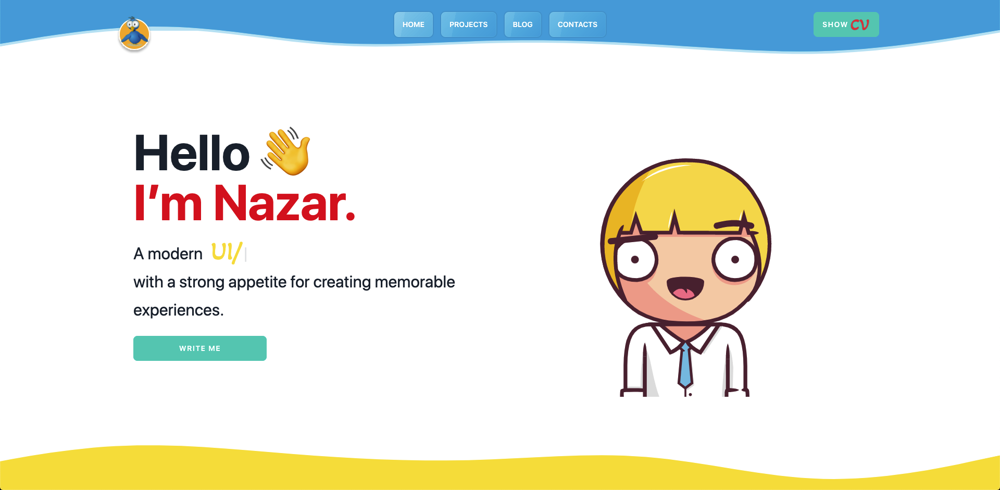

<!-- AUTO-GENERATED-CONTENT:START (STARTER) -->
<h1 align="center">
  My Gatsby's portfolio site
</h1>

<p align="center">
	
</p>

---

Technologies used:
- Gatsby
- GraphQL
- Tailwind CSS
- Styled-components
- Framer Motion

---
## 🚀 Quick start

1.  **install npm packages**

    After downloading packages, run the following command:

    ```shell
    npm install 
    ```

2.  **Start developing.**

    Navigate into your new site’s directory and start it up.

    ```shell
	npm start
    ```

3.  **Open the source code and start editing!**

    Your site is now running at `http://localhost:8000`!

    _Note: You'll also see a second link: _`http://localhost:8000/___graphql`_. This is a tool you can use to experiment with querying your data. Learn more about using this tool in the [Gatsby Tutorial](https://www.gatsbyjs.com/docs/tutorial/part-4/#use-graphiql-to-explore-the-data-layer-and-write-graphql-queries)._